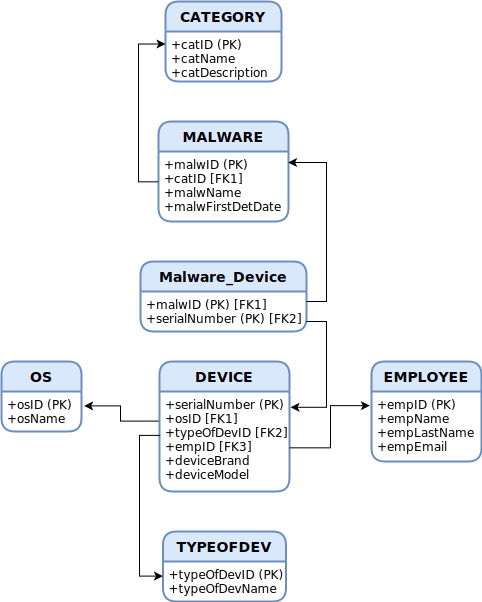

# Managment Of Infected Devices (Malware) :skull:
Project focused on the creation of a tool for the ***management*** of ***malware-infected*** ***devices***.

  

## Theme :bulb:
>Only luck is who can get rid of malware.

Analyzing the appointment and located within a business environment that can have hundreds of devices connected to your network, it is to be expected that a large number of them carry some type of malicious software. The equipment and personnel assigned to this problem they follow a fixed action scheme: identify and treat the affected hardware, freeing it from the infection.
The objective of the project is to create a tool for the management of devices infected with some type of malware. The idea is that once the assets have been identified,
can be registered in a centralized system that records them, their authorship and their evolution over time.
***
:es:
>Sólo la suerte es quién puede librarte del malware.

Analizando la cita y situados dentro de un entorno empresarial que puede llegar a contar con cientos de 
dispositivos conectados a su red, es de esperar que un gran número de los mismos sea portador de algún tipo de software malicioso. Los equipos y el personal destinados
a esta problemática siguen un esquema de actuación fijo: identificar y tratar el hardware afectado, liberándolo de la infección.
El objetivo del proyecto, es conformar una herramienta para la gestión de dispositivos infectados con algún tipo de malware. La idea es que una vez identificados los activos,
puedan ser registrados en un sistema centralizado que deje constancia de los mismos, la autoría de estos y su evolución en el tiempo.
## Planning :calendar:
| :heavy_check_mark: | :x: | :hourglass_flowing_sand: |
| --- | --- | --- |
| *Finished* | *Not finished* | *In progress* |

| :white_check_mark: | DATE | TASKS | RESOURCES |
| --- | --- | --- | --- |
| :heavy_check_mark: | ~~10/05/2022~~ | ~~Create repository on Github to store everything related to the project~~ | [Repository](https://github.com/fco-veragua/managtInfDev.git) |
| :heavy_check_mark: | ~~11/05/2022~~ | ~~Create task schedule~~ | Hello, It's me! |
| :heavy_check_mark: | ~~10/05/2022 - 11/05/2022~~ | ~~Establish the idea (theme) of the project~~ | Tool for managing malware-infected devices... |
| :heavy_check_mark: | ~~10/05/2022 - 12/05/2022~~ | ~~Create the necessary database schemas~~ | [ERModel](diagrams/E_R_model.drawio.svg):open_file_folder: [RelationalModel](diagrams/Relational_model.drawio.svg):open_file_folder: |
| :heavy_check_mark: | ~~12/05/2022~~ | ~~Create Diagram of the Entity Relationship Model~~ |  |
| :heavy_check_mark: | ~~12/05/2022~~ | ~~Create Relational Model Diagram~~ |  |
| :heavy_check_mark: | ~~12/05/2022 - 13/05/2022~~ | ~~Create Oracle Database Server via Docker or Virtual Machine~~ | |
| :hourglass_flowing_sand: | 13/05/2022 - Undefined | Create Tables and sample data in the database | |
| :hourglass_flowing_sand: | 13/05/2022 - Undefined | Define the microservices to create from the created database models | |
| :hourglass_flowing_sand: | 13/05/2022 - Undefined | Creation of Microservices | |
| :hourglass_flowing_sand: | 13/05/2022 - Undefined | Read documentation about KeyCloak and install it | |
| :x: | | Make de Use Cases of the application | |
## Diagram of the Entity Relationship Model :bar_chart:

## Relational Model Diagram :bar_chart:

## DataBase ***creation*** and Data ***insertion*** :hammer:
>For database implementation, I am using Oracle Database

Next, you have all the necessary code for the creation of the database tables (Relationships, data types, restrictions for the establishment of foreign keys...) Valid statements are also attached for the insertion of certain test data, which fill the data model with meaning and serve as examples during the data query from the microservices.

>At the end of this entire block, you can find a direct link to the original script from which all the instructions are based.
***
:es:
>Para la implementación de la base de datos, estoy usando Oracle Database

A continuación, tienes todo el código necesario para la creación de las tablas de la base de datos (Relaciones, tipos de datos, restricciones para el establecimiento de claves foráneas...) También se adjuntan sentencias válidas destinadas a la inserción de determinados datos de prueba, que colmen de sentido al modelo de datos y, sirvan de ejemplos durante la consulta de datos desde los microservicios.

>Al final de todo este bloque, podrás encontrar un enlace directo al script original del que parten todas las instrucciones.

***
#### :large_blue_circle: Script for Tables :page_facing_up:
~~~
------------------------------------------------------
-- managtInfDev - TABLES --
------------------------------------------------------
-- OS (osID, osName)
-- TYPEOFDEV (typeOfDevID, typeOfDevName)
-- EMPLOYEE (empID, empName, empLastName, empEmail)
-- DEVICE (serialNumber, osID, typeOfDevID, empID, deviceBrand, deviceModel)
-- CATEGORY (catID, catName, catDescription)
-- MALWARE (malwID, catID, malwName, malwFirstDetDate)
-- Malware_Device (malwID, serialNumber)
------------------------------------------------------
-- SET PROPER FORMAT --
------------------------------------------------------
ALTER SESSION SET NLS_DATE_FORMAT = 'DD/MM/YYYY HH24:MI';

------------------------------------------------------
-- DELETE OLD TABLES --
------------------------------------------------------
DROP TABLE OS CASCADE CONSTRAINTS;
DROP TABLE TYPEOFDEV CASCADE CONSTRAINTS;
DROP TABLE EMPLOYEE CASCADE CONSTRAINTS;
DROP TABLE DEVICE CASCADE CONSTRAINTS;
DROP TABLE CATEGORY CASCADE CONSTRAINTS;
DROP TABLE MALWARE CASCADE CONSTRAINTS;
DROP TABLE Malware_Device CASCADE CONSTRAINTS;

------------------------------------------------------
-- TABLE CREATION --
------------------------------------------------------
-- OS (osID, osName)
CREATE TABLE OS (
    osID    INT,
    osName  VARCHAR2(255),
    CONSTRAINT PK_OS PRIMARY KEY (osID)
);

-- TYPEOFDEV (typeOfDevID, typeOfDevName)
CREATE TABLE TYPEOFDEV (
    typeOfDevID     INT,
    typeOfDevName   VARCHAR2(255),
    CONSTRAINT PK_TYPEOFDEV PRIMARY KEY (typeOfDevID)
);

-- EMPLOYEE (empID, empName, empLastName, empEmail)
CREATE TABLE EMPLOYEE (
    empID       INT,
    empName     VARCHAR2(255),
    empLastName VARCHAR2(255),
    empEmail    VARCHAR2(255),
    CONSTRAINT PK_EMPLOYEE PRIMARY KEY (empID)
);

-- DEVICE (serialNumber, osID, typeOfDevID, empID, deviceBrand, deviceModel)
CREATE TABLE DEVICE (
    serialNumber    INT,
    osID            INT,
    typeOfDevID     INT,
    empID           INT,
    deviceBrand     VARCHAR2(255),
    deviceModel     VARCHAR2(255),
    CONSTRAINT PK_DEVICE PRIMARY KEY (serialNumber),
    CONSTRAINT FK1_DEVICE FOREIGN KEY (osID) REFERENCES OS (osID) ON DELETE CASCADE,
    CONSTRAINT FK2_DEVICE FOREIGN KEY (typeOfDevID) REFERENCES TYPEOFDEV (typeOfDevID) ON DELETE CASCADE,
    CONSTRAINT FK3_DEVICE FOREIGN KEY (empID) REFERENCES EMPLOYEE (empID) ON DELETE CASCADE
);

-- CATEGORY (catID, catName, catDescription)
CREATE TABLE CATEGORY (
    catID           INT,
    catName         VARCHAR2(255),
    catDescription  VARCHAR2(255),
    CONSTRAINT PK_CATEGORY PRIMARY KEY (catID)
);

-- MALWARE (malwID, catID, malwName, malwFirstDetDate)
CREATE TABLE MALWARE (
    malwID              INT,
    catID               INT,
    malwName            VARCHAR2(255),
    malwFirstDetDate    DATE,
    CONSTRAINT PK_MALWARE PRIMARY KEY (malwID),
    CONSTRAINT FK1_MALWARE FOREIGN KEY (catID) REFERENCES CATEGORY (catID) ON DELETE CASCADE
);

-- Malware_Device (malwID, serialNumber)
CREATE TABLE Malware_Device (
    malwID          INT,
    serialNumber    INT,
    CONSTRAINT PK_Malware_Device PRIMARY KEY (malwID, serialNumber),
    CONSTRAINT FK1_Malware_Device FOREIGN KEY (malwID) REFERENCES MALWARE (malwID) ON DELETE CASCADE,
    CONSTRAINT FK2_Malware_Device FOREIGN KEY (serialNumber) REFERENCES DEVICE (serialNumber) ON DELETE CASCADE
);
~~~
#### :large_blue_circle: Insert Test Data :page_facing_up:
~~~
------------------------------------------------------
-- DATA INSERTION --
------------------------------------------------------
-- OS (osID, osName)
INSERT INTO OS (osID, osName) VALUES (1111, 'Windows 10 Pro x64');
INSERT INTO OS (osID, osName) VALUES (2222, 'Windows Server 2019');
INSERT INTO OS (osID, osName) VALUES (3333, 'Ubuntu 20.04 LTS');
INSERT INTO OS (osID, osName) VALUES (4444, 'Android 12');
INSERT INTO OS (osID, osName) VALUES (5555, 'HP Futuresmart');
INSERT INTO OS (osID, osName) VALUES (6666, 'IOS 13.7');

-- TYPEOFDEV (typeOfDevID, typeOfDevName)
INSERT INTO TYPEOFDEV (typeOfDevID, typeOfDevName) VALUES (0001, 'Smartphone');
INSERT INTO TYPEOFDEV (typeOfDevID, typeOfDevName) VALUES (0002, 'Computer');
INSERT INTO TYPEOFDEV (typeOfDevID, typeOfDevName) VALUES (0003, 'Laptop');
INSERT INTO TYPEOFDEV (typeOfDevID, typeOfDevName) VALUES (0004, 'Printer');
INSERT INTO TYPEOFDEV (typeOfDevID, typeOfDevName) VALUES (0005, 'Tablet');
INSERT INTO TYPEOFDEV (typeOfDevID, typeOfDevName) VALUES (0006, 'Electronic Board');

-- EMPLOYEE (empID, empName, empLastName, empEmail)
INSERT INTO EMPLOYEE (empID, empName, empLastName, empEmail) VALUES (12222, 'Ada', 'Lovelace', 'adalovelace@gmail.com');
INSERT INTO EMPLOYEE (empID, empName, empLastName, empEmail) VALUES (13333, 'Gary', 'McKinnon', 'garymckinnon@gmail.com');
INSERT INTO EMPLOYEE (empID, empName, empLastName, empEmail) VALUES (14444, 'Chema', 'Alonso', 'chemaalonso@gmail.com');
INSERT INTO EMPLOYEE (empID, empName, empLastName, empEmail) VALUES (15555, 'Hedy', 'Lamarr', 'hedylamarr@gmail.com');
INSERT INTO EMPLOYEE (empID, empName, empLastName, empEmail) VALUES (16666, 'Evelyn', 'Berezin', 'evelynberezin@gmail.com');
INSERT INTO EMPLOYEE (empID, empName, empLastName, empEmail) VALUES (17777, 'Bill', 'Gates', 'billgates@gmail.com');

-- DEVICE (serialNumber, osID, typeOfDevID, empID, deviceBrand, deviceModel)
INSERT INTO DEVICE (serialNumber, osID, typeOfDevID, empID, deviceBrand, deviceModel) VALUES (00110011, 1111, 0003, 12222, 'Acer', 'Nitro 5');
INSERT INTO DEVICE (serialNumber, osID, typeOfDevID, empID, deviceBrand, deviceModel) VALUES (00220022, 2222, 0002, 13333, 'MSI', 'MAG Codex');
INSERT INTO DEVICE (serialNumber, osID, typeOfDevID, empID, deviceBrand, deviceModel) VALUES (00330033, 3333, 0006, 14444, 'Samsung', 'WM55H');
INSERT INTO DEVICE (serialNumber, osID, typeOfDevID, empID, deviceBrand, deviceModel) VALUES (00440044, 4444, 0001, 15555, 'Xiaomi', 'POCO F3');
INSERT INTO DEVICE (serialNumber, osID, typeOfDevID, empID, deviceBrand, deviceModel) VALUES (00550055, 5555, 0004, 16666, 'HP', 'ENVY');
INSERT INTO DEVICE (serialNumber, osID, typeOfDevID, empID, deviceBrand, deviceModel) VALUES (00660066, 6666, 0005, 17777, 'iPad', 'Air');

-- CATEGORY (catID, catName, catDescription)
INSERT INTO CATEGORY (catID, catName, catDescription) VALUES (1, 'Virus', 'Alter the operation of your device. Requires user intervention');
INSERT INTO CATEGORY (catID, catName, catDescription) VALUES (2, 'Worm', 'Similar to the virus, it tries to spread through your computer. Does not require user intervention');
INSERT INTO CATEGORY (catID, catName, catDescription) VALUES (3, 'Trojan', 'Disguises itself as legitimate files for you to run and start stealing info');
INSERT INTO CATEGORY (catID, catName, catDescription) VALUES (4, 'Spyware', 'Its objective is to be the spy that collects information from the user or company without their authorization');
INSERT INTO CATEGORY (catID, catName, catDescription) VALUES (5, 'Adware', 'It invades you with advertising, even stealing personal information');
INSERT INTO CATEGORY (catID, catName, catDescription) VALUES (6, 'Ransomware', 'Kidnaps data by encrypting it to ask for economic ransoms in exchange for releasing them');

-- MALWARE (malwID, catID, malwName, malwFirstDetDate)
INSERT INTO MALWARE (malwID, catID, malwName, malwFirstDetDate) VALUES (111, 1, 'ILOVEYOU', '01/01/2000');
INSERT INTO MALWARE (malwID, catID, malwName, malwFirstDetDate) VALUES (222, 3, 'ZEUS', '01/01/2009');
INSERT INTO MALWARE (malwID, catID, malwName, malwFirstDetDate) VALUES (333, 2, 'SOBIG', '01/01/2003');
INSERT INTO MALWARE (malwID, catID, malwName, malwFirstDetDate) VALUES (444, 4, 'Snake Keylogger', '01/01/2020');
INSERT INTO MALWARE (malwID, catID, malwName, malwFirstDetDate) VALUES (555, 5, 'Altnet', '01/01/2008');
INSERT INTO MALWARE (malwID, catID, malwName, malwFirstDetDate) VALUES (666, 6, 'Maze', '01/01/2019');

-- Malware_Device (malwID, serialNumber)
INSERT INTO Malware_Device (malwID, serialNumber) VALUES (111, 00110011);
INSERT INTO Malware_Device (malwID, serialNumber) VALUES (222, 00220022);
INSERT INTO Malware_Device (malwID, serialNumber) VALUES (333, 00550055);
INSERT INTO Malware_Device (malwID, serialNumber) VALUES (444, 00440044);
INSERT INTO Malware_Device (malwID, serialNumber) VALUES (555, 00330033);
INSERT INTO Malware_Device (malwID, serialNumber) VALUES (666, 00660066);
~~~
:link:
>From [here](dbResources/managtInfDev.sql) you can access the original script :scroll:
